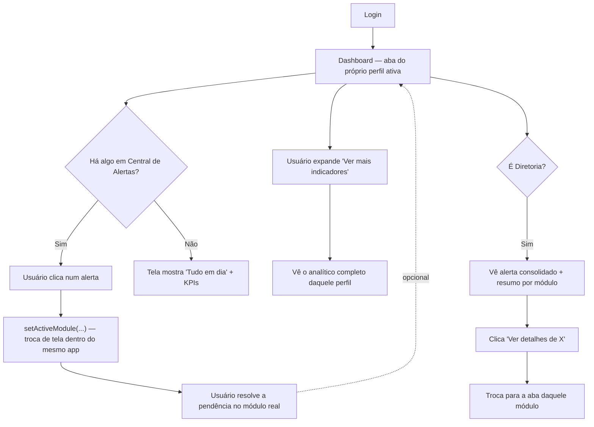

# ADR-019 — Redesenho de UX do Dashboard: Proposta (Subetapa 7.1 em implementação)

- **Status**: **Aprovada conceitualmente (2026-07-10), com 5 decisões + diretrizes adicionais do
  usuário (ver "Decisões e diretrizes da aprovação" ao final). Implementação em andamento, Subetapa
  7.1 concluída.** Diretriz permanente adicional do usuário: prioridade de layout **Ação → Resumo →
  Análise**; "detail" fechado por padrão mesmo em telas grandes; nenhuma tela deve exigir rolagem para
  entender o estado do setor (tudo essencial cabe na primeira dobra); cada subetapa visual exige
  validação antes da próxima.
- **Limitação de ferramental, disclosure necessária**: este ambiente não tem uma ferramenta de captura
  de tela/automação de navegador disponível. A validação visual pedida pelo usuário por subetapa é
  feita via mockup ASCII (antes de codar) + `pm2 restart` + o próprio usuário conferindo no navegador
  (depois de codar) — não capturas de tela geradas automaticamente. Subetapas puramente de metadado
  (como a 7.1) não têm nenhum visual novo, por natureza.
- **Data**: 2026-07-10
- **Contexto**: a Subetapa 7 (Frontend, ADR-017) entregou uma primeira versão funcional do novo
  Dashboard — grade única de 48 widgets, agrupados só por `type` (Indicadores/Gráficos/Tabelas). O
  usuário validou visualmente duas vezes (tradução de status, depois reorganização em seções) e, na
  terceira revisão, pediu uma parada estrutural: em vez de mais um ajuste incremental, uma revisão
  completa de experiência, atuando eu como Product Designer + UX/UI Architect, **sem ficar preso ao
  que já foi construído**.
- **Diretriz central do usuário, verbatim**: *"O usuário não pensa em widgets. Ele pensa em perguntas
  como: 'O que está atrasado hoje?', 'Tem alguma compra urgente?', 'Qual pedido precisa da minha
  atenção?', 'Como está o faturamento?', 'O estoque está crítico?', 'Tenho OP parada?' O dashboard deve
  responder essas perguntas em poucos segundos."*

---

## 1. Análise crítica da interface atual (o que foi construído na Subetapa 7)

Estrutura atual: `DashboardTabs` (abas por perfil) → `DashboardProfileView` (por perfil: filtro de
período, depois 3 seções — Indicadores, Gráficos, Tabelas analíticas — cada uma listando **todos** os
widgets daquele `type`, ordenados só por `ordemPadrao`).

### Problemas encontrados

1. **Taxonomia por tipo de renderização, não por significado.** "Indicadores/Gráficos/Tabelas" é uma
   categoria de **como o dado é desenhado**, não de **por que o usuário precisa dele**. É a estrutura
   do catálogo (`dashboard-widget-catalog.ts`) vazando diretamente pra tela — ótima para engenharia,
   sem nenhum significado para quem abre o sistema de manhã.
2. **Nenhuma hierarquia.** "Orçamentos vencidos" (precisa de ação agora) tem exatamente o mesmo peso
   visual que "Materiais mais consumidos" (informativo, sem urgência). O usuário tem que ler tudo pra
   descobrir o que importa — o oposto de "saber imediatamente o que precisa de atenção".
3. **Zero orientação à ação.** Todo widget é um beco sem saída: mostra um número, não deixa fazer
   nada com ele. Ver "3 aprovações pendentes" não leva a lugar nenhum — o usuário tem que sair do
   Dashboard, achar o módulo certo, navegar de novo.
4. **Diretoria = união bruta de 48 widgets, não uma síntese.** O mecanismo de composição (`getDashboard
   ('diretoria')` reúne tudo que os outros perfis têm) foi pensado para **não duplicar lógica entre
   perfis** (o que continua certo, arquiteturalmente) — mas o resultado visual é o **pior** painel do
   sistema, não o mais executivo: mais informação, não mais síntese. Contradiz diretamente "Diretoria
   vê KPIs consolidados".
5. **Todos os 48 sempre visíveis, sempre.** Nenhuma noção de "isso só importa quando for diferente de
   zero" (ex.: Ajustes de inventário, Volume de auditoria) nem de "isso é o tipo de coisa que se
   consulta, não que se monitora" (ex.: Top produtos, Distribuição por vendedor).
6. **Sem estado vazio inteligente.** Se está tudo em dia, a tela não diz "tudo em dia" — mostra 0 com o
   mesmo peso visual de qualquer outro número.
7. **Responsividade por acidente, não por decisão.** Os breakpoints (`sm`/`lg`) vêm do Tailwind
   padrão, nunca pensados especificamente para monitor ultrawide (cards esticados, muito espaço vazio)
   ou tablet (gráfico espremido).

**Não é um problema de execução técnica** — cada widget individualmente calcula e exibe o dado certo,
os testes provam isso. É um problema de **composição e hierarquia**: a peça certa, no lugar errado.

---

## 2. Princípio norteador: perguntas, não widgets

Cada perfil tem, na prática, **4 a 6 perguntas reais** que motivam abrir o sistema. Os 48 widgets já
implementados (nenhum dado novo necessário) respondem essas perguntas — a mudança é **qual pergunta
cada widget responde, e em que ordem de importância**, não o que o backend calcula.

Proposta de classificação de cada widget em 3 papéis (`kind`), aplicada por cima do catálogo já
existente — nenhuma mudança na Subetapa 1-6, só uma nova dimensão de metadado:

| `kind` | Papel | Tratamento visual |
|---|---|---|
| **alert** | Um número que normalmente deveria ser zero/baixo; quando não é, exige uma decisão agora | Card de destaque, cor de atenção quando > 0, botão de ação direta pro módulo |
| **kpi** | Um número/gráfico que importa **toda vez** que se olha (termômetro de saúde do processo) | Card/gráfico headline, sempre visível, sem colapsar |
| **detail** | Dado analítico de apoio — útil, não urgente | Agrupado numa seção recolhida por padrão ("Ver mais indicadores") |

### 2.1 Comercial — "Como está meu pipeline?"

| Pergunta real | Widget(s) já existentes | `kind` | Ação |
|---|---|---|---|
| Tenho orçamento parado que precisa de mim? | `orcamentos-vencidos` | **alert** | Ver Orçamentos |
| Como está o negócio, em número? | `valor-aprovado-por-periodo`, `taxa-conversao` | kpi | — |
| Meu funil está saudável? | `orcamentos-por-status` | kpi | — |
| Quem são meus melhores clientes/produtos? | `top-clientes`, `top-produtos` | detail | — |
| Tudo o mais (ticket médio, tempos, distribuição por vendedor, clientes novos, pedidos por status, clientes/produtos ativos) | 8 widgets | detail | — |

### 2.2 PCP / Produção — "Minha produção está em dia?"

| Pergunta real | Widget(s) | `kind` | Ação |
|---|---|---|---|
| Tenho OP atrasada? | `ops-atrasadas` | **alert** | Ver Produção |
| Vou faltar material e travar a produção? | `cobertura-reserva` (shortfall > 0), `sugestoes-mrp-por-status` (pendentes > 0) | **alert** | Ver Estoque / Ver Requisições |
| Como está a carga de trabalho agora? | `ops-por-status`, `wip-total` | kpi | — |
| Tudo o mais (backlog, prioridade, rodadas parciais, MRP compra×produção, resumo MRP, volume de lotes, adoção de lote, revisões de BOM) | 8 widgets | detail | — |

### 2.3 Compras — "Tem algo urgente pra eu decidir?"

| Pergunta real | Widget(s) | `kind` | Ação |
|---|---|---|---|
| O que está esperando minha aprovação agora? | `aprovacoes-pendentes` | **alert** | Ver Compras |
| Meus pedidos estão fluindo? | `pedidos-por-status`, `valor-total-po` | kpi | — |
| Tudo o mais (requisições por status/tipo/origem, tempo de ciclo, % atendido por estoque, tempo por etapa, performance de fornecedor, taxa de vitória) | 7 widgets | detail | — |

### 2.4 Estoque — "O estoque está crítico?"

| Pergunta real | Widget(s) | `kind` | Ação |
|---|---|---|---|
| Tenho material acabando? | `materiais-baixo-estoque` | **alert** | Ver Estoque |
| Tenho lote vencendo? | `lotes-vencendo` | **alert** | Ver Estoque |
| Qual o valor do que tenho parado? | `saldo-valorizado-quantidade` | kpi | — |
| Tudo o mais (saldo por item, reservado/a caminho, movimentações por tipo, mais consumidos, ajustes) | 5 widgets | detail | — |

### 2.5 Administrativo — "O sistema está saudável?"

Perfil genuinamente de baixa urgência (não há "obrigação" administrativa diária) — sem seção de
alerta; `usuarios-ativos-por-papel` como kpi, os outros 3 como detail. Está certo esse perfil ser mais
"consulta" que "monitoramento".

### 2.6 Diretoria — não é união, é síntese

**Mudança mais importante da proposta.** Diretoria deixa de compor os 48 widgets e passa a ter uma
visão **própria e deliberadamente menor**:
- **Central de Alertas consolidada** — todo widget `kind='alert'` de todos os módulos, num único
  lugar (é literalmente a pergunta "o que precisa de mim, na empresa inteira, agora?").
- **Resumo por módulo** — 1 KPI headline por módulo (Comercial/Produção/Compras/Estoque), cada um com
  "Ver detalhes de X →" para abrir aquele perfil específico se quiser se aprofundar.
- **Sem seção "detail"** — quem quiser o analítico completo troca de aba. Diretoria nunca mostra os
  48 widgets simultaneamente.

---

## 3. Wireframe

### 3.1 Diretoria

```
┌──────────────────────────────────────────────────────────────────────┐
│  Dashboard · Diretoria                     [30d] [90d] [Personalizado]│
├──────────────────────────────────────────────────────────────────────┤
│  🔔 CENTRAL DE ALERTAS (7 itens precisam de atenção)                   │
│  ┌────────────────────────────┐  ┌────────────────────────────┐      │
│  │ ⚠  3   Orçamentos vencidos  │  │ ⚠  2   OPs atrasadas        │      │
│  │        [Ver Comercial →]    │  │        [Ver Produção →]     │      │
│  └────────────────────────────┘  └────────────────────────────┘      │
│  ┌────────────────────────────┐  ┌────────────────────────────┐      │
│  │ ⚠  5   Aprovações pendentes │  │ ⚠  4   Materiais em falta   │      │
│  │        [Ver Compras →]      │  │        [Ver Estoque →]      │      │
│  └────────────────────────────┘  └────────────────────────────┘      │
├──────────────────────────────────────────────────────────────────────┤
│  VISÃO GERAL                                                          │
│  ┌───────────┐  ┌───────────┐  ┌───────────┐  ┌───────────┐          │
│  │ Comercial │  │ Produção  │  │  Compras  │  │  Estoque  │          │
│  │ R$ 240k   │  │ 120 un WIP│  │ R$ 85k    │  │ R$ 310k   │          │
│  │ aprovado  │  │           │  │ em pedidos│  │ valorizado│          │
│  │ Ver mais →│  │ Ver mais →│  │ Ver mais →│  │ Ver mais →│          │
│  └───────────┘  └───────────┘  └───────────┘  └───────────┘          │
└──────────────────────────────────────────────────────────────────────┘
```

### 3.2 Comercial (padrão que se repete, com variações, para os demais perfis operacionais)

```
┌──────────────────────────────────────────────────────────────────────┐
│  Dashboard · Comercial                     [30d] [90d] [Personalizado]│
├──────────────────────────────────────────────────────────────────────┤
│  🔔 PRECISA DE ATENÇÃO                                                 │
│  ┌──────────────────────────────────────────────────────────────┐    │
│  │ ⚠  3 orçamentos vencidos, ainda em aberto   [Ver Orçamentos →]│    │
│  └──────────────────────────────────────────────────────────────┘    │
├──────────────────────────────────────────────────────────────────────┤
│  RESUMO                                                               │
│  ┌────────────────┐  ┌────────────────┐  ┌──────────────────────┐    │
│  │ Valor aprovado  │  │ Taxa conversão │  │  Orçamentos por status│    │
│  │  R$ 240.000     │  │      42%       │  │      (donut)          │    │
│  └────────────────┘  └────────────────┘  └──────────────────────┘    │
├──────────────────────────────────────────────────────────────────────┤
│  ▾ Ver mais indicadores (9)                                           │
│    Top clientes · Top produtos · Ticket médio · Tempos · ...         │
│    (recolhido por padrão, expande ao clicar)                         │
└──────────────────────────────────────────────────────────────────────┘
```

### 3.3 Fluxo de navegação (Mermaid)



---

## 4. Arquitetura de componentes React (proposta)

```
DashboardTabs                          (existente, mantido)
 ├─ DashboardProfileView               (reescrito — perfis operacionais)
 │   ├─ DashboardPeriodFilter          (existente, mantido)
 │   ├─ DashboardAlertCenter (NOVO)
 │   │   └─ DashboardAlertCard (NOVO)  — ícone + contagem + rótulo + botão de ação
 │   ├─ DashboardKpiRow (NOVO)         — reaproveita DashboardWidgetCard/DashboardChart
 │   └─ DashboardSecondaryDetails (NOVO, Accordion/Collapsible)
 │       └─ reaproveita DashboardWidgetTable/DashboardChart para o conteúdo interno
 │
 └─ DashboardDiretoriaView (NOVO — não usa DashboardProfileView genérico;
     composição deliberadamente diferente, nunca lista os 48 widgets)
     ├─ DashboardAlertCenter (reaproveitado, agregando alerts de todos os módulos)
     └─ DashboardModuleSummaryCard × 4 (NOVO) — 1 KPI por módulo + link "Ver detalhes"
```

**O que NÃO muda**: `DashboardChart`, `DashboardWidgetTable`, `DashboardWidgetCard`,
`DashboardPeriodFilter`, `dashboard-status-labels.ts`, toda a API/backend (Subetapas 1-6) — nenhum
deles precisa mudar. Esta proposta é só uma nova camada de **composição/apresentação** por cima do que
já existe e já foi testado.

**Extensão de metadado proposta** (aditiva, no catálogo já existente, sem tocar `implementado`/
`dependencias`/o resto):

```ts
export interface DashboardWidgetCatalogEntry {
  // ...campos existentes, inalterados...
  kind: 'alert' | 'kpi' | 'detail'   // NOVO
  linkToModule?: string              // NOVO — ModuleKey do page.tsx, só quando kind === 'alert'
}
```

**Navegação**: `page.tsx` passa `onNavigate={(mod) => setActiveModule(mod)}` para `DashboardTabs`, que
repassa para `DashboardProfileView`/`DashboardDiretoriaView` → `DashboardAlertCenter`/
`DashboardModuleSummaryCard`. Como o app é uma SPA de estado único (`activeModule`), "abrir Produção" é
literalmente trocar esse estado — nenhuma rota nova, nenhum reload.

### Nuance técnica a validar (decisão pendente #1)

3 widgets hoje têm forma de tabela/gráfico, não de card com um número único: `cobertura-reserva`
(shortfall), `sugestoes-mrp-por-status` (pendentes), `materiais-baixo-estoque` (linhas da tabela).
Transformar isso num badge de alerta significa **contar/somar o array já recebido da API** (ex.:
`data.rows.length`, ou somar `shortfall` já presente nos dados) — é agregação de apresentação sobre um
payload que já chegou pronto, não recálculo de regra de negócio nova. Ainda assim, é uma decisão de
design que prefiro confirmar com o usuário antes de implementar (Subetapa 7.2).

---

## 5. Responsividade

| Faixa | Comportamento |
|---|---|
| Mobile/tablet (< 768px) | 1 coluna em tudo; Central de Alertas empilhada; seção "detail" totalmente recolhida por padrão (menos rolagem) |
| Notebook (768–1536px) | Alertas em 2 colunas, KPIs em 3-4 colunas, gráficos 1-2 colunas — próximo do que já existe hoje |
| Ultrawide (> 1536px) | Container com `max-width` (proposta: ~1600px, centralizado) — não esticar cards finos até a borda da tela; o espaço extra vira mais colunas na seção "detail" quando expandida, não cards gigantes vazios |

---

## 6. Viabilidade de personalização futura (avaliação, não implementação)

A arquitetura de catálogo+registry (Subetapas 1-6) já deixa isso barato de adicionar depois, **sem
tocar em nenhum cálculo de widget**:

- Um novo model pequeno (ex.: `DashboardUserPreference { userId, profile, hiddenWidgetIds Json,
  pinnedWidgetIds Json, customOrder Json }`) guarda só preferências de exibição.
- Ocultar/favoritar/reordenar acontece **inteiramente no cliente**, filtrando/reordenando o mesmo
  payload que a API já devolve — nenhum widget precisa ser recalculado de forma diferente.
- Recolher um card é puramente um estado de UI (`localStorage` ou a mesma tabela de preferências).

**Não recomendo construir isso agora** — é a keyword "viabilidade", não uma subetapa desta proposta.
Fica registrado como caminho aberto para quando o usuário quiser.

---

## 7. Plano de implementação em subetapas pequenas (só após aprovação)

Substitui o que restava da Subetapa 7 original (a versão "grade única" já entregue é o ponto de
partida, não descartada tecnicamente — os componentes-folha são reaproveitados).

| Subetapa | Entrega | Checkpoint |
|---|---|---|
| **7.1** | Estender o catálogo com `kind`/`linkToModule` nas 48 entradas (só dado, zero mudança de comportamento visível) + testes de integridade atualizados | tsc/lint/build/test |
| **7.2** | `DashboardAlertCenter` + `DashboardAlertCard`, `onNavigate` ligado a `setActiveModule` real no `page.tsx` | Validação visual: clicar um alerta troca de tela de verdade |
| **7.3** | `DashboardKpiRow` por perfil operacional (usa `kind==='kpi'`) | Validação visual |
| **7.4** | `DashboardSecondaryDetails` recolhível (usa `kind==='detail'`) — substitui as seções atuais "Gráficos"/"Tabelas" | Validação visual |
| **7.5** | `DashboardDiretoriaView` dedicado — Central de Alertas consolidada + resumo por módulo, substitui a composição de união total | Validação visual — este é o ponto mais crítico da proposta |
| **7.6** | QA responsivo (notebook/ultrawide/tablet) | Validação visual em pelo menos 2 tamanhos de tela |
| **7.7** | Remover a estrutura "Indicadores/Gráficos/Tabelas" antiga do `dashboard-profile-view.tsx`, finalizar | tsc/lint/build/test + validação visual final |

Cada subetapa segue a mesma disciplina já usada em toda a Fase 11: implementar, testar (o que for
testável — lógica de classificação/agregação de apresentação pode ganhar testes unitários; a
renderização em si continua sem suíte de componente, validada visualmente), relatório, aprovação antes
da próxima.

---

## 8. Riscos e decisões pendentes

1. **Confirmar a classificação `alert`/`kpi`/`detail`** proposta nas tabelas da Seção 2 — é a decisão
   de design mais importante deste documento; ajustes são baratos agora, caros depois de implementado.
2. **Confirmar os `linkToModule` propostos** (ex.: `orcamentos-vencidos` → módulo `orcamentos`, não
   `clientes`) — nomes exatos de módulo do `page.tsx` a confirmar antes da Subetapa 7.2.
3. **Nuance técnica da Seção 4** (extrair contagem de alerta de widgets hoje em formato tabela/gráfico)
   — confirmar que é aceitável como agregação de apresentação.
4. **Central de Alertas da Diretoria**: mostrar todos os alertas de todos os módulos sempre, ou um
   resumo "X alertas ativos" com expansão? Proposta acima assume "sempre visível, todos" — mas se
   crescer muito (muitos módulos, muitos alertas), pode precisar de paginação/priorização no futuro.
5. **Nome da seção "Ver mais indicadores"** — pode virar um problema de descoberta (usuário nunca
   expande, nunca vê os 30+ widgets "detail"). Mitigação proposta: manter expandida por padrão em
   telas grandes (notebook+), só recolher por padrão em mobile/tablet.

---

## Conclusão

Esta proposta não descarta nenhum trabalho de backend (Subetapas 1-6, 48 widgets, filtro de período) —
recompõe a **apresentação** deles em torno de perguntas reais, com hierarquia (alerta → KPI → detalhe),
ação (link direto pro módulo) e uma Diretoria que sintetiza em vez de concatenar.

## Decisões e diretrizes da aprovação (2026-07-10)

| # | Decisão | Resolução |
|---|---|---|
| 1 | Classificação alert/kpi/detail | **Aprovada** — vira a base da experiência; objetivo do dashboard passa a ser "destacar prioridades", não "mostrar dados" |
| 2 | `linkToModule` | **Aprovado** — todo alerta deve levar ao módulo certo no menor número de cliques possível, idealmente já na visão filtrada |
| 3 | Agregações de apresentação para virar alerta (contar linhas/somar shortfall de um payload já recebido) | **Aprovado**, desde que não introduza regra de negócio nova — informação que já existe, só melhor apresentada |
| 4 | Central de Alertas da Diretoria | **Refinada**: não uma lista de dezenas de alertas — críticos primeiro, resumo por módulo, expansível para ver todos. Diretoria nunca é uma cópia dos outros perfis |
| 5 | Seção "detail" | **Fechada por padrão, inclusive em telas grandes** (não só mobile/tablet como a proposta original sugeria) |
| + | Prioridade de layout | **Ação → Resumo → Análise**, sempre, em toda decisão de composição |
| + | Simplicidade sobre densidade | Na dúvida entre mais informação ou simplificar, **simplificar** |
| + | Zero rolagem para entender a situação | A primeira dobra (sem rolar) deve conter tudo essencial — estado do setor em segundos |
| + | Validação por subetapa | Mockup/descrição antes de codar + confirmação visual do usuário depois de cada subetapa visual, antes da próxima |

**Subetapa 7.1 concluída** — ver seção própria abaixo. Subetapas 7.2-7.7 seguem o plano da Seção 7,
cada uma aguardando validação antes da próxima.

## Subetapa 7.1 — Implementação (2026-07-10)

Estende `dashboard-widget-catalog.ts` com `kind: 'alert' | 'kpi' | 'detail'` e `linkToModule?: string`
para as 48 entradas — **puro metadado, zero mudança de comportamento visível** (nenhum componente lê
esses campos ainda; isso começa na Subetapa 7.2). Classificação aplicada exatamente conforme a Seção 2
deste ADR: **7 alerts**, **9 kpis**, **32 details**.

| Widget (alert) | `linkToModule` |
|---|---|
| `comercial.orcamentos-vencidos` | `orcamentos` |
| `producao.ops-atrasadas` | `producao` |
| `producao.cobertura-reserva` | `requisicoes` |
| `producao.sugestoes-mrp-por-status` | `requisicoes` |
| `estoque.materiais-baixo-estoque` | `estoque` |
| `estoque.lotes-vencendo` | `estoque` |
| `compras.aprovacoes-pendentes` | `compras` |

`linkToModule` usa os valores exatos de `ModuleKey` do `page.tsx` — a decisão pendente #2 do ADR foi
resolvida com esta escolha; **sinalizar se algum destino não for o esperado** (ex.: `cobertura-reserva`
e `sugestoes-mrp-por-status` apontam para `requisicoes`, não `producao`, porque a ação real diante de
um shortfall é gerar/acompanhar uma requisição, não abrir a OP em si — julgamento de design, não uma
certeza).

Novo: `getWidgetsByKind(kind)` no catálogo. 4 testes novos (`tests/dashboard-widgets-infra.test.ts`):
todo `kind` é um dos 3 valores válidos; `linkToModule` existe se e somente se `kind==='alert'`;
`getWidgetsByKind` particiona corretamente os 48. `tsc`/lint (59, sem novo)/build limpos; `npm test`
**233/233** (230 + 3). Sem visual — subetapa de metadado puro, nada para conferir no navegador ainda.

**Subetapa 7.1 concluída — próxima é 7.2 (Alert Center + navegação real), a primeira com algo visual
para validar.**

### Ajuste pós-aprovação da 7.1

Usuário refinou o conceito de `linkToModule`: não é "onde o dado mora", é "onde o problema se
resolve primeiro". `producao.sugestoes-mrp-por-status` mudou de `requisicoes` para `producao` — MRP é
atividade de planejamento do PCP, a ação inicial é revisar/processar a sugestão dentro do fluxo de
Produção, só depois ela vira requisição. Comentário no código já deixa isso preparado para uma
evolução futura (navegação condicional pra Requisições quando a sugestão já tiver virado uma).
`cobertura-reserva` → `requisicoes` confirmado sem mudança. tsc/testes de integridade reconfirmados
(22/22 no arquivo, sem regressão).

## Subetapa 7.2 — Mockup para validação (antes de codar)

Por pedido explícito do usuário: nenhuma implementação visual definitiva antes de validar o desenho.
3 cenários abaixo cobrem o que o usuário pediu para avaliar: hierarquia visual, clareza de estados,
navegação, quantidade de informação sem rolagem, estado vazio, e a ordem Ação→Resumo→Análise.

### Cenário A — Perfil operacional com 1 alerta ativo (Comercial)

```
┌────────────────────────────────────────────────────────────────┐
│  Dashboard · Comercial                [30d] [90d] [Personalizado]│
├────────────────────────────────────────────────────────────────┤
│  AÇÃO                                                            │
│  ┌──────────────────────────────────────────────────────────┐  │
│  │ 🟡  3   Orçamentos vencidos            [Ver Orçamentos →]  │  │
│  └──────────────────────────────────────────────────────────┘  │
├────────────────────────────────────────────────────────────────┤
│  RESUMO                                                          │
│  ┌───────────────┐ ┌───────────────┐ ┌────────────────────┐    │
│  │ Valor aprovado│ │ Taxa conversão│ │ Orçamentos p/ status│    │
│  │  R$ 240.000   │ │      42%      │ │      (donut)         │    │
│  └───────────────┘ └───────────────┘ └────────────────────┘    │
├────────────────────────────────────────────────────────────────┤
│  ▸ Ver mais indicadores (9)                     [fechado]       │
└────────────────────────────────────────────────────────────────┘
   ↑ tudo isso cabe sem rolar num notebook comum (1366×768+)
```

### Cenário B — Estado vazio (nenhum alerta ativo)

```
┌────────────────────────────────────────────────────────────────┐
│  Dashboard · Estoque                  [30d] [90d] [Personalizado]│
├────────────────────────────────────────────────────────────────┤
│  ┌──────────────────────────────────────────────────────────┐  │
│  │  ✅  Tudo em dia — nenhum alerta ativo em Estoque          │  │
│  └──────────────────────────────────────────────────────────┘  │
├────────────────────────────────────────────────────────────────┤
│  RESUMO                                                          │
│  ┌───────────────────────┐                                      │
│  │ Saldo valorizado       │                                      │
│  │   1.240 un             │                                      │
│  └───────────────────────┘                                      │
├────────────────────────────────────────────────────────────────┤
│  ▸ Ver mais indicadores (6)                     [fechado]        │
└────────────────────────────────────────────────────────────────┘
```

### Cenário C — Diretoria (com estado crítico)

```
┌────────────────────────────────────────────────────────────────────┐
│  Dashboard · Diretoria                    [30d] [90d] [Personalizado]│
├────────────────────────────────────────────────────────────────────┤
│  AÇÃO — 3 áreas precisam de atenção                                  │
│  ┌────────────────────────────┐  ┌────────────────────────────┐    │
│  │ 🔴  7   Aprovações pendentes │  │ 🟡  2   OPs atrasadas        │    │
│  │        [Ver Compras →]      │  │        [Ver Produção →]     │    │
│  └────────────────────────────┘  └────────────────────────────┘    │
│  ┌────────────────────────────┐                                     │
│  │ 🟡  1   Lote vencendo        │                                     │
│  │        [Ver Estoque →]      │                                     │
│  └────────────────────────────┘                                     │
│  ▸ Ver todos os alertas (3 de 3 exibidos)                            │
├────────────────────────────────────────────────────────────────────┤
│  RESUMO POR MÓDULO                                                   │
│  ┌───────────┐  ┌───────────┐  ┌───────────┐  ┌───────────┐        │
│  │ Comercial │  │ Produção  │  │  Compras  │  │  Estoque  │        │
│  │ R$ 240k   │  │ 120un WIP │  │  R$ 85k   │  │ 1.240 un  │        │
│  │ Ver mais →│  │ Ver mais →│  │ Ver mais →│  │ Ver mais →│        │
│  └───────────┘  └───────────┘  └───────────┘  └───────────┘        │
└────────────────────────────────────────────────────────────────────┘
```

### Regras de design propostas (a confirmar antes de codar)

1. **Hierarquia dentro da Central de Alertas**: ordenar por severidade (crítico → atenção) e, dentro de
   cada grupo, do maior para o menor número — não pela ordem do catálogo.
2. **Estados — proposta de regra, número do limiar em aberto**: `count === 0` → widget não aparece
   como card de alerta (contribui pro estado vazio); `0 < count ≤ 5` → 🟡 atenção; `count > 5` → 🔴
   crítico. **O "5" é um chute inicial, não uma regra de negócio validada — preciso da sua confirmação
   do número (ou de uma regra diferente, ex.: alguns tipos de alerta serem sempre críticos
   independente da contagem, como "Aprovações pendentes" vs. "Lotes vencendo").**
3. **Estado vazio**: mensagem positiva e específica do perfil ("Tudo em dia — nenhum alerta ativo em
   X"), não um card de contagem zero com o mesmo visual dos demais.
4. **Diretoria**: mostra só os alertas mais relevantes por padrão (proposta: todos, já que o volume
   observado — 7 no catálogo inteiro — é pequeno o suficiente para caber sem rolagem; se crescer muito
   no futuro, aí sim paginar/priorizar) + "Ver todos" só aparece quando há mais do que cabe na tela.
5. **Ação → Resumo → Análise**: a Central de Alertas (Ação) sempre no topo; RESUMO (KPIs) logo abaixo;
   "Ver mais indicadores" (Análise) sempre por último e sempre fechado.

Nenhum componente React foi criado nesta rodada — só os 3 mockups acima e a regra de severidade
proposta, aguardando validação antes da implementação da Subetapa 7.2.

### Subetapa 7.2 — Implementação (2026-07-13)

**A regra de severidade proposta acima (limiar numérico global 0/1-5/>5) foi REJEITADA pelo usuário.**
Decisão substituta (verbatim, resumida): "Não quero um limiar numérico global. A severidade deve ser
definida por regra do próprio alerta." Arquitetura exigida: **cada widget de alerta calcula sua
própria severidade por uma função específica do seu domínio**, considerando o fator certo para aquele
tipo de problema (prazo, proximidade, risco operacional, tempo bloqueando um fluxo) — nunca só a
contagem. E, diretriz arquitetural crítica: **a classificação de severidade fica desacoplada da
interface** — o backend entrega `severity`/`count`/`message`/`linkToModule` prontos; o frontend só
renderiza, nunca recalcula.

**Mudança de tipo**: `DashboardWidgetType` ganhou `'alert'` (`dashboard-types.ts`), com uma nova
interface `DashboardAlertData { severity: 'critical'|'warning'|'info'; count; message; linkToModule }`.
Os 7 widgets `kind: 'alert'` do catálogo passaram de `card`/`chart`/`table` para `type: 'alert'` — a
"nuance técnica" da Seção 4 (extrair uma contagem de alerta de widgets antes tabela/gráfico é uma
agregação de apresentação aceitável, não recálculo de regra de negócio) se aplicou a
`cobertura-reserva`, `sugestoes-mrp-por-status` e `materiais-baixo-estoque` exatamente como previsto.

**Regra de severidade por alerta** (cada uma implementada como função própria no arquivo de widgets do
seu domínio, limiares documentados como constantes, ajustáveis, não travados no código):

| Widget | Fator decisivo (não é só contagem) | Regra |
|---|---|---|
| `comercial.orcamentos-vencidos` | dias de atraso da validade (máximo entre os vencidos) | crítico se > 15 dias; senão atenção |
| `producao.ops-atrasadas` | dias de atraso E quantidade pendente somada | crítico se atraso máximo ≥ 7 dias OU quantidade pendente total ≥ 100 |
| `producao.cobertura-reserva` | % do necessário em falta (só reservas `status='partial'`, não `consumed`/`released`) | crítico se shortfall/needed ≥ 20% |
| `producao.sugestoes-mrp-por-status` | fração pendente do total (ignora filtro de período — pendência antiga é mais urgente, não menos) | crítico se pendentes/total > 50% |
| `estoque.materiais-baixo-estoque` | menor razão stockQty/minStockQty entre os materiais baixos (proxy de risco operacional) | crítico se razão ≤ 50% |
| `estoque.lotes-vencendo` | proximidade real do vencimento (dias mínimos até `expiresAt`), não a contagem de lotes | crítico se vencimento em ≤ 7 dias |
| `compras.aprovacoes-pendentes` | há quanto tempo a mais antiga está esperando (via `StatusHistory`, `toStatus='pending_approval'`) | crítico se espera máxima ≥ 3 dias OU count ≥ 5 |

**Gap de dado sinalizado, não decidido silenciosamente**: `materiais-baixo-estoque` pedia "risco
operacional" (ex.: material essencial crítico mesmo em pequena falta) — o schema de `Material` não tem
hoje um campo de criticidade/essencialidade. Implementei uma aproximação com o dado que já existe
(razão estoque atual/mínimo), documentada em comentário no código
(`dashboard-widgets-estoque.ts`). Um campo real de criticidade exigiria alteração de schema, fora do
escopo desta subetapa — fica registrado para decisão futura, não inventado às escondidas.

**Repository**: 3 métodos novos (`findActivePartialReservations`, `findPendingApprovalAges`) + 2
substituídos por uma versão que devolve os dados brutos em vez de só a contagem
(`countExpiringBatches`→`findExpiringBatches`, `countPendingApprovals`→`findPendingApprovalAges`);
`findOpenProductionOrdersWithDueDate` ganhou `quantity`/`quantityCompleted` no select.

**Frontend — 2 componentes novos, puramente renderizadores**: `DashboardAlertCard` (ícone + rótulo de
severidade + título + frase explicativa + botão "Resolver agora →", nunca "Ver X →" — ação clara,
conforme pedido) e `DashboardAlertCenter` (ordena por severidade→contagem, filtra `count=0`, estado
vazio positivo com indicador de frescor "Última atualização: há N minutos", e um limite de 4 alertas
visíveis por padrão só na Diretoria — `maxVisible` — com expansão "Ver todos os alertas"). Nenhum dos
dois recalcula severidade — só leem o campo já pronto. `DashboardProfileView` ganhou a seção "O que
precisa da sua atenção agora" no topo (Ação → Resumo → Análise), com `fetchedAt` rastreado no `useEffect`
existente. Navegação real: `onNavigate` threaded `page.tsx` (`setActiveModule`) → `DashboardTabs` →
`DashboardProfileView` → `DashboardAlertCenter` → `DashboardAlertCard`, sem lista fixa de módulos.

**Testes**: 4 arquivos de teste (comercial/produção-estoque/compras) atualizados para o novo formato
`DashboardAlertData` + 4 testes novos de consistência catálogo↔DTO (`widget.type==='alert'` sse
`catalogEntry.kind==='alert'`) + 1 teste novo cobrindo a escalada de severidade por tempo de espera em
`aprovacoes-pendentes`. **237/237 testes**, tsc limpo, lint 59 (sem novo warning), build limpo, PM2
reiniciado.

**Pendente de validação do usuário** (checklist da aprovação da 7.1, reaplicado): hierarquia visual dos
alertas, clareza dos 3 estados, facilidade de navegação (botão "Resolver agora"), densidade sem
scroll, estado vazio, consistência Ação→Resumo→Análise — agora com dados reais computados pelo
backend, não mais um mockup ASCII.

### Subetapa 7.2 — Aprovada; evolução visual "Centro de Comando" (2026-07-13)

Arquitetura de severidade (backend decoupled, regra por alerta) **aprovada sem ressalvas**. Antes de
avançar para 7.3, o usuário pediu que os alertas deixassem de parecer "cards" soltos e passassem a
comunicar prioridade como um Centro de Comando de verdade, com diretrizes explícitas: hierarquia por
tamanho/posição/espaçamento (nunca só cor); crítico/atenção/destino legíveis em <5 segundos; card
inteiro clicável, com "Resolver agora →" como reforço visual, não único alvo de clique; ícones e
indicadores de contexto em vez de texto longo; densidade sem poluição.

Implementado em `dashboard-alert-card.tsx`/`dashboard-alert-center.tsx` (nenhuma mudança de backend):
- **Agrupamento por severidade com headers próprios** — "🔴 Crítico — requer ação imediata" sempre no
  topo, "🟡 Atenção — monitorar" abaixo — em vez de uma grade única ordenada por severidade. A posição
  e a separação visual comunicam prioridade antes mesmo de ler a cor.
- **Peso visual proporcional à severidade, não só cor**: crítico ganha borda dupla + fundo tintado
  (`bg-red-50`/`dark:bg-red-950`), título maior/bold, badge de contagem preenchido, e um indicador
  pulsante (`motion-safe:animate-ping`, respeita `prefers-reduced-motion`) — 3 canais além da cor
  (tamanho, preenchimento, movimento). Atenção é deliberadamente mais compacto (borda fina, sem tinta
  de fundo), reforçando por contraste que crítico é mais urgente.
  <br>Grid também reforça isso: crítico ocupa até 2 colunas largas (`lg:grid-cols-2`), atenção cabe 3
  por linha (`lg:grid-cols-3`) — cards críticos literalmente maiores na tela.
- **Card inteiro é um `<button>` clicável** (`onClick={() => onNavigate(...)}`), com "Resolver agora →"
  como um `<span>` estilizado dentro dele (não um `<button>` aninhado — evita elemento interativo
  dentro de elemento interativo, quebra de acessibilidade) — clique em qualquer parte do card navega.
- **Contagem como badge circular** (não mais só um número solto no card) — leitura rápida por forma.

`getWidgetsByKind`/severidade/mensagens não mudaram — puramente CSS/estrutura de apresentação. `tsc`/
lint(59, sem novo)/build limpos, `pm2 restart` executado.

### Subetapa 7.3 — KPI Row (2026-07-13)

Novo componente `DashboardKpiRow` (`dashboard-kpi-row.tsx`) — recebe só widgets com
`catalogEntry.kind === 'kpi'`, delega a renderização a `DashboardWidgetRenderer` (mesmo dispatcher já
usado em todo o dashboard, reaproveitado sem mudança, conforme Seção 4), separando cards compactos
(grade densa `lg:grid-cols-4`) de gráficos-resumo (`lg:grid-cols-2`, mais largos). `dashboard-widget-
catalog.ts` marca 9 widgets como `kind:'kpi'` — 5 são `type:'card'`, 4 são `type:'chart'` (breakdowns
por status como donut) — o componente já lida com essa mistura desde o início, não assume só cards.

`DashboardProfileView` ganhou uma nova seção "Resumo" (nova 2ª camada de Ação→Resumo→Análise) logo
após a Central de Alertas, usando `getCatalogEntry(widget.id).kind` (o mesmo metadado já usado pelo
`DashboardAlertCenter`) para extrair os KPIs do payload. Os widgets `kind:'kpi'` saíram das antigas
seções "Indicadores"/"Gráficos"/"Tabelas" — que ficaram só com `kind:'detail'` e foram renomeadas para
"Outros indicadores" como rótulo transitório, já que a Subetapa 7.4 vai substituí-las por um único
bloco recolhível (`DashboardSecondaryDetails`). Nenhuma mudança de backend/API — `getDashboard()` e os
DTOs continuam idênticos, só a composição visual do frontend mudou.

237/237 testes (nenhum teste de backend precisou mudar), `tsc`/lint(59, sem novo)/build limpos, `pm2
restart` executado. **Autorizado a prosseguir; próxima é a Subetapa 7.4 (detalhe recolhível).**

### Subetapas 7.2/7.3 aprovadas sem ressalvas — refinamentos antes da 7.4 (2026-07-13)

Usuário validou explicitamente todos os pontos das Subetapas 7.2/7.3 (separação Crítico/Atenção por
hierarquia não só cor; card inteiro clicável; KPIs logo após os alertas; backend/API inalterados).
Pediu 3 refinamentos antes de finalizar a 7.4:

1. **A seção de detalhe não deve ser só um bloco recolhível — deve comunicar uma mudança de contexto**
   (ação → consulta). Cabeçalho sugerido verbatim: "Análises detalhadas" / "Indicadores históricos,
   gráficos e métricas para acompanhamento."
2. **Arquitetura de tendência nos KPIs** (`trend`/`trendValue`/`trendLabel`) — sem exigir cálculo
   histórico agora, mas o componente já deve aceitar esses campos sem precisar mudar layout depois.
3. **Identidade própria por seção**, perceptível mesmo sem ler os títulos — Centro de Comando (Ação),
   Resumo Operacional (KPIs), Análises Detalhadas (Exploração).

**Implementado em duas partes.** Primeiro, o que não dependia de mockup: `DashboardCardData` ganhou
`trend?: 'up'|'down'|'stable'`, `trendValue?`, `trendLabel?` (`dashboard-types.ts`) — `DashboardWidgetCard`
já renderiza a seta (↑ verde/↓ vermelho/→ cinza) + valor + rótulo quando presentes, mas nenhum widget
os preenche ainda (dormant, pronto pra uso futuro). As duas primeiras seções ganharam cabeçalho com
ícone+título+subtítulo ("Centro de Comando" com `Radar` vermelho; "Resumo Operacional" com `Gauge`
primary, dentro de um painel `bg-muted/30` que já separa visualmente do Centro de Comando acima).

Depois, apresentei um mockup ASCII da área de exploração (fechada por padrão, cabeçalho com contagem
de indicadores, borda tracejada neutra, expande no lugar) — **aprovado pelo usuário** ("Perfeito, esta
ok"). Implementado como `dashboard-secondary-details.tsx` (`DashboardSecondaryDetails`): substitui as 3
seções soltas "Outros indicadores"/"Gráficos"/"Tabelas analíticas" por um único bloco `<button>`
colapsável, **fechado por padrão sempre** (mesmo em telas grandes, diretriz de zero-scroll), com o
cabeçalho exato pedido pelo usuário + contagem total de indicadores + chevron. Ao expandir, mantém o
mesmo agrupamento por tipo (Indicadores/Gráficos/Tabelas) de antes — nenhuma lógica nova, só
reorganização visual. Estilo deliberadamente neutro (cinza, borda tracejada, sem cor de severidade nem
o `primary` do Resumo) para que o tom sozinho já comunique "isso é consultivo/opcional".

237/237 testes, `tsc`/lint(59, sem novo)/build limpos, `pm2 restart` executado. **Subetapa 7.4
concluída — Fase 11 chega ao fim das 7 subetapas do plano original do ADR-019 (7.1-7.4 implementadas;
7.5 Diretoria dedicada, 7.6 QA responsivo e 7.7 remover estrutura antiga ainda pendentes, mais a
Subetapa 8 de descontinuar o dashboard antigo).**

### Pausa — Subetapa 7.5 (2026-07-13)

Um mockup ASCII da `DashboardDiretoriaView` (Resumo por Módulo, headline por módulo, "Ver detalhes de
X") foi apresentado para validação quando o usuário pediu uma mudança de direção: em vez de continuar
subetapa por subetapa só no Dashboard, quer uma revisão de UX/UI de **todo o ERP** como produto — ver
`docs/adr/ADR-018-fase-11-5-consolidacao-ux-ui.md`, que deixa de ser só registro e passa a receber o
levantamento completo. **Subetapa 7.5 fica pausada, não descartada** — o mockup já apresentado continua
válido como ponto de partida quando o Dashboard voltar a ser trabalhado isoladamente, o que só deve
acontecer depois que a proposta ERP-wide for aprovada e (se fizer sentido) a incorporar/ajustar.

### Subetapa 7.5 — Retomada e implementação (2026-07-14)

Retomada depois que a Fase 11.5 (Plataforma Frontend, ADR-018) fechou oficialmente e a Fase 12
(Financeiro) chegou às Subetapas 1-7 completas — a condição de retomada registrada na pausa acima
("depois que a proposta ERP-wide for aprovada e escopada") estava satisfeita.

O mockup ASCII original (Seção 3.1) nunca tinha sido persistido neste ADR — só apresentado no chat, e
o pivô interrompeu antes da aprovação. Como o tempo passou e o Financeiro passou a existir de verdade
desde então, um mockup **refeito** foi apresentado para validação em vez de simplesmente implementar o
original de memória:

```
┌──────────────────────────────────────────────────────────────────────┐
│  Dashboard · Diretoria                     [30d] [90d] [Personalizado]│
├──────────────────────────────────────────────────────────────────────┤
│  🔔 CENTRAL DE ALERTAS (7 itens precisam de atenção)                   │
│  ┌────────────────────────────┐  ┌────────────────────────────┐      │
│  │ ⚠  3   Orçamentos vencidos  │  │ ⚠  2   OPs atrasadas        │      │
│  │        [Ver Comercial →]    │  │        [Ver Produção →]     │      │
│  └────────────────────────────┘  └────────────────────────────┘      │
│  ┌────────────────────────────┐  ┌────────────────────────────┐      │
│  │ ⚠  5   Aprovações pendentes │  │ ⚠  4   Materiais em falta   │      │
│  │        [Ver Compras →]      │  │        [Ver Estoque →]      │      │
│  └────────────────────────────┘  └────────────────────────────┘      │
├──────────────────────────────────────────────────────────────────────┤
│  VISÃO GERAL                                                          │
│  ┌───────────┐ ┌───────────┐ ┌───────────┐ ┌───────────┐ ┌──────────┐│
│  │ Comercial │ │ Produção  │ │  Compras  │ │  Estoque  │ │Financeiro││
│  │ R$ 240k   │ │ 120 un WIP│ │ R$ 85k    │ │ R$ 310k   │ │R$ 42k    ││
│  │ aprovado  │ │           │ │ em pedidos│ │ valorizado│ │em aberto ││
│  │ Ver mais →│ │ Ver mais →│ │ Ver mais →│ │ Ver mais →│ │Ver mais →││
│  └───────────┘ └───────────┘ └───────────┘ └───────────┘ └──────────┘│
└──────────────────────────────────────────────────────────────────────┘
```

Única diferença real em relação ao original: o 5º card "Financeiro" — impossível em 10/07 (o módulo
nem existia), possível agora porque `FinancialReportService.getAccountBalances()` (Fase 12, Subetapa 6)
já calcula saldo real de Contas a Pagar/Receber. **Usuário aprovou incluindo o card Financeiro.**

**Implementação**:

- **Achado**: `PROFILE_CONTENT_SOURCES.financeiro` sempre foi só `['comercial', 'compras']` (reaproveita
  widgets, nunca teve um widget PRÓPRIO — achado do Hardening pós-11.5). Para o card "Financeiro" do
  Resumo por Módulo mostrar um número real, o perfil precisava do seu primeiro widget nativo.
- Novo widget `financeiro.saldo-liquido-em-aberto` (`dashboard-widgets-financeiro.ts`) — delega 100% a
  `financialReportService.getAccountBalances()` (zero recálculo), `value = receivable.open −
  payable.open`. `financeiro` vira `WidgetSourceProfile` de verdade; `PROFILE_CONTENT_SOURCES.financeiro`
  ganha `'financeiro'` como 3ª fonte — o widget passa a aparecer também na própria aba Financeiro, não só
  emprestado pela Diretoria.
- **2º achado, durante a implementação**: o candidato natural para o headline de Compras
  (`compras.valor-total-po`) é na verdade um **gráfico** (série por status/fornecedor), não um número
  único — não existia nenhum KPI de valor agregado de Compras no catálogo. Mesmo padrão do achado do
  Financeiro: um card só funciona com um número, não uma série. Adicionado
  `compras.valor-total-po-periodo` (mesma consulta de `compras.valor-total-po`, já somada em vez de
  agrupada — nenhuma query nova), também disponível na própria aba Compras.
- **Arquitetura**: Diretoria deixou de ser uma composição genérica (`getDashboard('diretoria')`, união
  bruta de tudo) — ganhou `getDiretoriaSummary()` (`dashboard-widgets.service.ts`), com DTO próprio
  (`DashboardDiretoriaPayloadDTO { alerts, moduleSummaries }`, `dashboard-types.ts`). Central de Alertas
  reaproveita `getAllAlerts()` sem mudança (já existia, mesma função do sino de notificações). `Resumo
  por Módulo` usa uma nova função privada `getWidgetsByIds()` para computar só os 5 widgets headline
  (1 por módulo), sem pagar o custo de computar o catálogo inteiro de cada perfil. `getDashboard('diretoria')`
  continua existindo e correta (união completa, agora incluindo `financeiro` nas suas fontes) — só não é
  mais o que a tela real usa, mantida para qualquer chamador futuro que precise da composição bruta.
  A rota `/api/dashboard/v2/[profile]` passa a ramificar: `diretoria` chama `getDiretoriaSummary()`, todo
  o resto continua chamando `getDashboard()` sem mudança.
- Frontend: `DashboardDiretoriaView` (novo, substitui `DashboardProfileView` só para `profile ===
  'diretoria'` em `dashboard-tabs.tsx`) — Central de Alertas (mesmo `DashboardAlertCenter`,
  `maxVisible=4`) + seção "Visão Geral" com `DashboardModuleSummaryCard` (novo — mesma anatomia de
  `DashboardWidgetCard`, com um botão "Ver detalhes de X →" que os KPIs comuns não têm). **Sem seção de
  detalhe** — quem quiser o analítico completo troca de aba (Seção 2.6 da proposta original, nunca
  contrariada). `PROFILE_ICONS` (antes privado a `dashboard-profile-view.tsx`) exportado para reuso.
- 3 testes novos (`tests/dashboard-diretoria-summary.test.ts`): `getDiretoriaSummary()` devolve
  exatamente 1 headline por módulo com o `linkModule` certo; nunca inclui um widget `kind==='detail'`;
  o widget do Financeiro calcula `receber − pagar` corretamente contra dado real semeado via o fluxo
  completo de Orçamento→Pedido→Fatura→Recebimento. 2 testes pré-existentes tiveram contagens
  hardcoded atualizadas (44→45 categorias Comercial+Produção+Estoque+Compras, 9→10 widgets de Compras)
  — consequência direta e esperada dos 2 novos widgets, não uma regressão.

291/291 testes, tsc limpo, lint 61 (60 + 1 instância do mesmo padrão sistêmico de `setState` em efeito
de fetch já presente em `dashboard-profile-view.tsx` e replicado nesta subetapa — sem alternativa local
sem refatorar o padrão de fetch em todo o Dashboard v2, mesmo raciocínio já aplicado ao Financeiro),
build limpo, `pm2 restart` + smoke test HTTP 200 confirmados. **Validação visual funcional fica
pendente do usuário no navegador** — mesma regra permanente do projeto (sem ferramenta de
screenshot/e2e automatizado).

### Subetapa 7.5 — 2 correções encontradas na validação visual do usuário (2026-07-14, mesmo dia)

**Achado 1 — texto vazando do card**: o botão "Ver detalhes de {label} →" de `DashboardModuleSummaryCard`
estourava a largura do card em telas de 4-5 colunas. Causa: o `Button` base (shadcn) tem
`whitespace-nowrap` — texto mais longo que o espaço disponível vaza em vez de quebrar linha, e o mockup
aprovado (Seção 3.1) já usava o copy curto "Ver mais →", não "Ver detalhes de X" (deriva introduzida
durante a implementação, não parte do que foi aprovado). Corrigido revertendo pro copy aprovado + `Card`
com `overflow-hidden` + `Button` com `w-full` + `truncate` no valor — defesa em profundidade, não só o
texto do botão.

**Achado 2 — número monetário sem formatação** ("Comercial 15960", ilegível): vários widgets tipo
`card` cujo valor é monetário devolviam o número cru (`value: result._sum.total || 0`), sem "R$" nem
separador de milhar — `DashboardWidgetCard`/`DashboardModuleSummaryCard` nunca formatavam, só
exibiam `{data.value}` literalmente. Corrigido na raiz: `DashboardCardData` ganhou `format?: 'currency'`
(`dashboard-types.ts`), aplicado centralmente nos 2 componentes de renderização via `formatCurrency()` —
nenhum widget formata a string sozinho, evita a mesma inconsistência que a Hardening pós-11.5 já teve
que corrigir uma vez (`formatCurrency()` com/sem prefixo "R$" espalhado pelos call sites). 4 widgets
existentes marcados `format: 'currency'`: `comercial.valor-aprovado-por-periodo`, `comercial.ticket-medio`,
`compras.valor-total-po-periodo`, `financeiro.saldo-liquido-em-aberto`.

**Achado 3, encontrado auditando o Achado 2 antes de reportar como resolvido**: o headline de Estoque
usado no Resumo por Módulo (`estoque.saldo-valorizado-quantidade`) na verdade é uma **quantidade**, não
moeda — o próprio hint do widget já dizia isso ("valorização em R$ depende do Financeiro (Fase 12)"),
escrito antes do Financeiro existir. Mesma classe do achado já resolvido pra Compras na implementação
original desta subetapa (candidato natural que não é o número certo). Como `StockValuationService`
(Fase 12, Subetapa 5) já existe, criado `estoque.valor-total-estoque` (delega 100% a
`getTotalValuation()`, zero recálculo) e trocado no `MODULE_HEADLINES` — também aparece agora na própria
aba Estoque, não só emprestado pela Diretoria.

1 teste novo (`format: 'currency'` presente nos 4 headlines monetários, ausente no de Produção que é
quantidade), 3 testes pré-existentes com contagens de catálogo hardcoded atualizadas (mesma classe de
manutenção já vista após os achados 2/3 da implementação original — cada widget novo exige achar e
atualizar toda contagem fixa que dependia do total antigo). 292/292 testes, tsc/lint(61, líquido zero)/
build limpos, `pm2 restart` + smoke test confirmados.

**Achado 4 — `hint` cortado no meio da frase** ("A receber: R$ 0,00 · A", achado do usuário, ilegível):
depois do Achado 2 corrigido, o `DashboardModuleSummaryCard` passou a exibir `data.hint` do widget
subjacente (ex. o texto explicativo de `financeiro.saldo-liquido-em-aberto`) — mas em 5 colunas, hints
mais longos (principalmente os 2 novos, "A receber: X · A pagar: Y" e "Matéria-prima: X · Produto
acabado: Y") não cabem nem truncados de forma legível. Investigado contra o mockup aprovado (Seção 3.1):
ele nunca teve uma 2ª linha de texto sob o valor, só rótulo + número + botão — o hint nem deveria estar
ali. Removido `data.hint` do `DashboardModuleSummaryCard` (o texto completo continua disponível na
própria aba do módulo, via `DashboardWidgetCard`, mais largo). Correção de design (voltar ao que foi
aprovado), não uma correção de CSS.

**Achado 5 — o próprio valor truncava** ("R$ 15…", achado do usuário, screenshot mostrando "R$ 15....",
"R$ 315..."): mesmo depois do Achado 4, o número em si não cabia. Causa: a anatomia original (ícone de
48px + `gap-4` ao LADO do valor em `text-2xl`) deixava pouca largura sobrando num card de 5 colunas —
"R$ 15.960,00" já não cabia. Reestruturado pra 2 linhas: ícone (reduzido a 28px) + rótulo compactos em
cima, valor (`text-xl`, ainda `truncate` como rede de segurança) numa linha própria embaixo, nunca
disputando espaço horizontal com o ícone. Puramente CSS/estrutura, zero mudança de dado ou de API.

**Subetapa 7.5 concluída (com as 3 correções pós-validação incorporadas). Restam 7.6 (QA responsivo) e
7.7 (remover a estrutura antiga de 3 seções — já não existe mais, virou `DashboardSecondaryDetails` na
7.4, então 7.7 pode já estar de facto resolvida, a confirmar), mais a Subetapa 8 (descontinuar o
dashboard antigo).**

## Subetapa 7.6 — QA responsivo (implementada, 2026-07-14)

Auditoria de código contra a especificação da Seção 5 (mobile <768px / notebook 768-1536px / ultrawide
>1536px) em todos os componentes do Dashboard v2 — sem ferramenta de screenshot neste ambiente, a
verificação visual final depende do usuário redimensionando o navegador. 3 gaps reais encontrados e
corrigidos, todos puramente CSS/estrutura, zero mudança de dado ou API:

1. **Sem container de largura máxima em ultrawide** — a Seção 5 já prometia isso ("não esticar cards
   finos até a borda da tela"), mas `page.tsx` nunca implementou nenhum `max-width` pro bloco do
   Dashboard v2 (nem nenhum outro módulo do ERP tem isso, confirmado antes de escrever). Adicionado
   `max-w-[1600px] mx-auto`, escopado só ao Dashboard v2 — nenhum outro módulo foi tocado (essa é uma
   decisão maior, do pivô ERP-wide ainda não aprovado, não desta subetapa).
2. **Faixa de abas de perfil rolava a página inteira em mobile** — `admin`/`manager` enxergam até 8
   perfis (`diretoria/comercial/pcp/compras/producao/estoque/administrativo/financeiro`); `TabsList`
   nunca quebra linha (`w-fit`) e o `<main>` da página tem `overflow-auto` nos dois eixos — em telas
   estreitas, isso rolava a tela inteira na horizontal pra ver as últimas abas. Corrigido contendo a
   rolagem só na própria faixa de abas (`overflow-x-auto` num wrapper dedicado).
3. **Grade "Visão Geral" da Diretoria pulava pra 5 colunas cedo demais** — `xl:grid-cols-5` ativava a
   partir de 1280px, dentro da faixa "notebook" (768-1536px) que a própria Seção 5 já reservava pra
   3-4 colunas — exatamente a faixa onde os Achados 4/5 da correção pós-validação apareceram (cards
   espremidos). Adiado pra `2xl:grid-cols-5` (1536px), o mesmo limiar de ultrawide que o ADR já
   documentava — fecha o risco de recorrência da mesma classe de bug em notebooks comuns (1280-1366px).

Verificado e confirmado OK sem mudança: tabelas analíticas (`Table` primitivo já embrulha
`overflow-x-auto` desde a Fase 11.5, plataforma); gráficos (`ResponsiveContainer width="100%"` já usado
em todo `DashboardChart`); filtro de período (`flex-wrap` já existente, empilha graciosamente); grades de
KPI Row/Alert Center (breakpoints já dentro do espírito da Seção 5, não achado de bug).

tsc/lint(61, líquido zero)/build/292 testes limpos (nenhuma lógica tocada), `pm2 restart` + smoke test
confirmados. **Verificação visual final (mobile/tablet/ultrawide de verdade) pendente do usuário — sem
ferramenta de screenshot neste ambiente.**

**Subetapa 7.6 concluída. Restam 7.7 (provavelmente já resolvida de facto pela 7.4, a confirmar quando
tocada) e a Subetapa 8 (descontinuar o dashboard antigo).**

## Subetapa 8 — Descontinuação do dashboard antigo (implementada, 2026-07-14)

Escopo original (ADR-017 §16/§19, item 8): "descontinuação do dashboard atual — só após validação
completa do novo (decisão registrada #3), incluindo a limpeza de nomenclatura da rota `v2`." Validação
completa já aconteceu ao longo das Subetapas 7.1-7.6 (o usuário conferiu cada uma no navegador).

**Removido** (mapeado antes de tocar em qualquer coisa — nenhum outro consumidor encontrado):
`src/app/services/dashboard.service.ts` (`getStats()` — só o Orçamento, sem RBAC por perfil, sem
período, sem widgets); `src/app/api/dashboard/stats/route.ts`; o bloco JSX do dashboard antigo em
`page.tsx` (4 cards fixos + tabela de Orçamentos recentes); os states `dashStats`/`dashLoading`, a
interface `DashboardStats`, o callback `loadDashboard` e sua entrada no mapa `loads` do efeito de troca
de módulo. Nenhum teste cobria esse código (confirmado por busca — zero arquivos referenciavam
`dashboardService`/`getStats`/`/api/dashboard/stats`), então nada precisou de atualização de suíte por
esta remoção.

**Limpeza de nomenclatura da rota `v2`** (mesma subetapa, per ADR-017 §16): `src/app/api/dashboard/v2/
[profile]/route.ts` → `src/app/api/dashboard/[profile]/route.ts`, atualizados os 2 call sites que
montavam a URL (`dashboard-diretoria-view.tsx`, `dashboard-profile-view.tsx`) e os comentários que
citavam o path antigo (`dashboard-bootstrap.ts` e os próprios componentes).

**`ModuleKey` colapsado**: `'dashboard'` e `'dashboard-v2'` eram 2 chaves distintas — sem o antigo pra
distinguir, `'dashboard-v2'` foi removida e `'dashboard'` passou a apontar pro Dashboard novo (mesmo
componente `<DashboardTabs>`, rótulo do menu volta a ser só "Dashboard", sem o qualificador "(Novo)").

**Decisão de acesso, consultada explicitamente antes de implementar**: o dashboard antigo tinha acesso
universal (`canAccess('dashboard') → true` pra todo Role); o novo é sempre por perfil operacional
(`getAccessibleProfiles(userRole).length > 0`). Os papéis `user`/`viewer` nunca foram mapeados em
`PROFILE_ACCESS` (não têm área operacional própria) — sem o antigo como rede de segurança, esses 2
papéis ficam sem nenhum item de Dashboard no menu. **Usuário confirmou aceitar essa consequência**
(consistente com o próprio Dashboard v2 ser por perfil, nunca genérico, e com a correção já feita na
Hardening pós-11.5 de esconder o item quando não há perfil acessível, em vez de levar a um beco sem
saída). `canAccess('dashboard')` unificado para usar sempre essa regra.

**Limpeza de imports mortos em `page.tsx`**, confirmados sem nenhum outro uso no arquivo antes de
remover: `formatCurrency`/`statusLabels` (`@/lib/format`), `StatusBadge`, `EmptyTableRow`,
`TableSkeleton`, o ícone `Truck`, e toda a família `Table`/`TableHeader`/`TableBody`/`TableRow`/
`TableHead`/`TableCell` (`@/components/ui/table`) — todos exclusivos do dashboard antigo. O linter
deste projeto não sinaliza import não utilizado como warning (confirmado antes de remover manualmente,
não coberto automaticamente), então essa limpeza foi feita por auditoria manual, não por aviso do
`eslint`.

**Achado antigo do ADR-017 fechado de passagem**: `page.tsx:67` tinha um `type Role` local duplicado e
desatualizado (`'admin' | 'manager' | 'user' | 'viewer'`, só 4 dos 9 papéis reais) — já catalogado no
levantamento original com a nota explícita "alinhar quando a Subetapa 8 tocar essa área". Como esta
subetapa tocou exatamente essa área, trocado por `import { type Role } from '@/app/middleware/rbac'`
(fonte única de verdade) — os 2 únicos usos (a declaração e `userRole = ... as Role`) não quebraram,
confirmado por `tsc`.

292/292 testes (nenhum tocava o código removido), tsc limpo (inclusive `.next/dev/types/validator.ts`
regenerado — tinha uma referência obsoleta à rota apagada, artefato de build, não erro de código),
lint 61 (líquido zero), build limpo (rota `/api/dashboard/[profile]` confirmada no manifesto,
`/api/dashboard/stats` e `/api/dashboard/v2/*` confirmadas ausentes), `pm2 restart` + smoke test HTTP
200 confirmados.

**Com isso, a Fase 11 (Dashboard e KPIs) está oficialmente concluída** — Subetapas 1-8 completas,
dashboard único, modular por widget, por perfil operacional, com Central de Comando + Resumo + Análises
Detalhadas + síntese dedicada da Diretoria, QA responsivo feito, e o dashboard legado removido. Item 7.7
do plano original (remover a estrutura antiga de 3 seções) confirmado como já resolvido de facto pela
Subetapa 7.4 (`DashboardSecondaryDetails`) — nenhum código adicional necessário.
